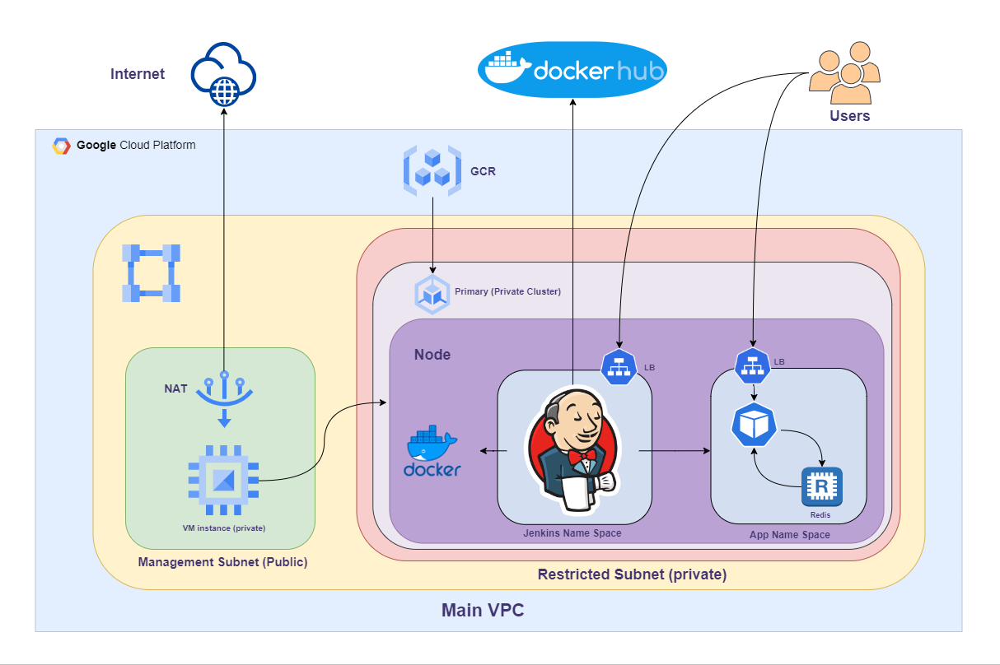
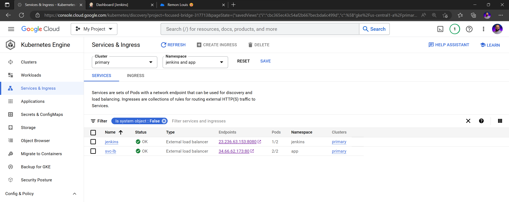
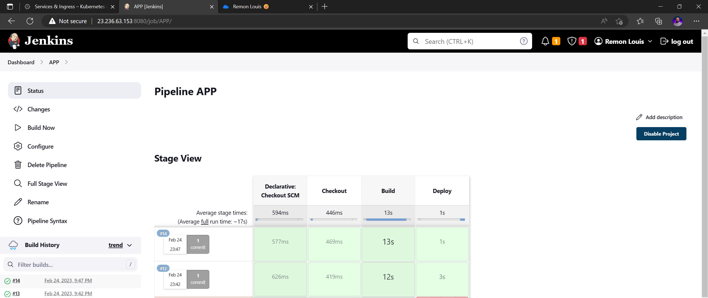
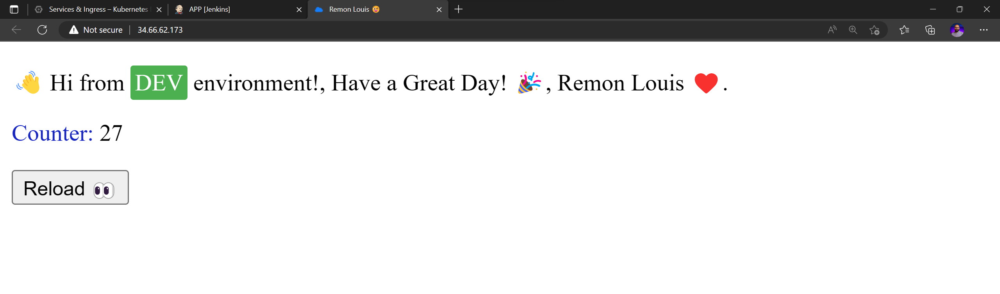

# ITI - Final Task

**This repository contains Terraform configuration for setting up infrastructure on Google Cloud Platform (GCP) using Infrastructure as Code (IaC) principles, Installing Jenkins and build pipeline to deploy an application on GKE**

## Requirements
-   git & gitbash
-   Terraform
-   Docker
-   Google Cloud SDK
-   Access to a GCP project with the necessary permissions to create and manage resources.
-   A bucket for the terraform state.

## Flow Chart




</br>

---

</br>


## Getting started

### Local Steps

1. clone this repo :
   ```bash
    git clone https://github.com/95remon/Final-Task-CI-CD-ITI.git
   ```

2. Navigate to Infrastructure-code directory.

3. Change the needed fields as back-end bucket name, Project ID, .... etc.

4. Run terraform commands:
    ```bash
    terraform init
    ```
    
    ```bash
    terraform apply
    ```

5. Navigate to Needed-Files directory.

6. Build Dockerfile and push image to GCR (Replace "focused-bridge-317713" with your project ID):

    ```bash
        docker build . -t gcr.io/focused-bridge-317713/jenkins:v2.0
    ```
    ```bash
        docker push gcr.io/focused-bridge-317713/jenkins:v2.0
    ```


</br>

---

</br>


### Private VM Steps

1. SSH the VM through browser
2. Update and Install Needed packages
    ```bash
        sudo apt update
    ```
    ```bash
        sudo apt-get install kubectl
    ```
3. Auth login
    ```bash
        gcloud auth login
    ```
    and follow the kink and complete the login steps

4.  Install gke-gcloud-auth-plugin 
    ```bash
        sudo apt-get install google-cloud-sdk-gke-gcloud-auth-plugin
    ```
5. Connect to cluster (Replace Zone and prject with yours)
    ```bash
        gcloud container clusters get-credentials primary --zone us-central1-a --project focused-bridge-317713
    ```

6. Vim or Upload the YAML files in "Needed-Files" path

7. Create jenkins namespace
    ```bash
        kubectl apply -f NS.yaml 
    ``` 

8. Create Service Account
    ```bash
        kubectl apply -f SA.yaml
    ```

9. Create Cluster Role 
    ```bash
        kubectl apply -f CR.yaml
    ```

10. Create Cluster Role Binding
    ```bash
        kubectl apply -f CRB.yaml
    ```

11. Create Persistent Volume To save /Jenkins_home Data to prevent losing it if pod destroyed.
    ```bash
        kubectl apply -f PV.yaml 
    ```

12. Create Persistent Volume Claim
    ```bash
        kubectl apply -f PVC.yaml
    ```

13. Create Daemon Set to install Docker on the node
    ```bash
        kubectl apply -f Daemonset.yaml
    ```

14. Create Deployment for the jenkins
    ```bash
        kubectl apply -f Deployment.yaml
    ```

15. Create Load Balancer
    ```bash
        kubectl apply -f LB.yaml
    ```


</br>

---

</br>


### Jenkins Configrations

1.  Open Jenkins LoadBalancer Endpoint.
2.  Exec the Container and get the First Password.
3.  Open Jenkins and Create Admin account .
4.  Add GitHub and DockerHub Credentials.
5.  Create Pipeline with Pipeline script from Git SCM  and add this Repo https://github.com/95remon/Simple-App-CI-CD-ITI.git.
6.  And Click build Now.


</br>

---

</br>


## Output ScreenShoots






